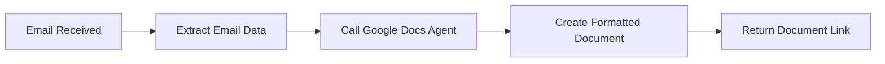
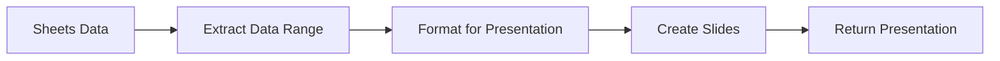
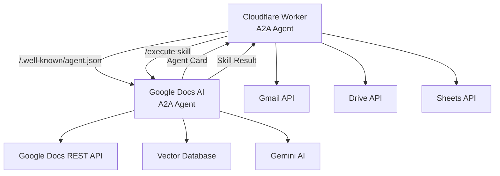

# A2A (Agent-to-Agent) Protocol Integration

This Cloudflare Worker now supports the A2A (Agent-to-Agent) protocol, enabling seamless communication with other A2A-enabled agents. The implementation follows the A2A protocol standard from [A2AApp](https://github.com/tanaikech/A2AApp).

## 🌟 Features

### A2A Server Capabilities (Other agents can call this worker)
- **Gmail Operations**: Send, read, search, and manage Gmail messages
- **Google Drive Management**: Create, read, update, delete files and folders
- **Google Sheets Data Operations**: Read, write, analyze data in spreadsheets
- **Google Slides Presentations**: Create and modify presentations
- **Email Processing & Analysis**: Advanced email processing with spam detection
- **Cross-Service Orchestration**: Workflows across multiple Google Workspace services

### A2A Client Capabilities (This worker can call other agents)
- **Google Docs AI Assistant Integration**: Document operations, vector search, conversational AI
- **Agent Discovery**: Automatic discovery and caching of other A2A agents
- **Cross-Agent Workflows**: Email → Document, Data → Presentation workflows

## 📋 A2A Protocol Endpoints

### Server Endpoints (Exposed by this worker)

| Endpoint | Method | Description |
|----------|--------|-------------|
| `/.well-known/agent.json` | GET | Agent discovery card |
| `/execute` | POST | Skill execution endpoint |
| `/health` | GET | Health check |

### Client Endpoints (For calling other agents)

| Endpoint | Method | Description |
|----------|--------|-------------|
| `/a2a/discover` | POST | Discover external A2A agents |
| `/a2a/call` | POST | Execute skill on external agent |
| `/a2a/agents` | GET | List cached agents |
| `/a2a/status` | GET | A2A configuration and status |

### Google Docs AI Assistant Integration

| Endpoint | Method | Description |
|----------|--------|-------------|
| `/a2a/docs/operations` | POST | Document operations via Google Docs agent |
| `/a2a/docs/search` | POST | Vector search via Google Docs agent |
| `/a2a/docs/chat` | POST | Conversational AI via Google Docs agent |
| `/a2a/workflows/email-to-doc` | POST | Email to Document workflow |

## 🚀 Quick Start

### 1. Update Agent Configuration

Before using the A2A integration, update the Google Docs agent URLs in `/src/services/a2a-client.ts`:

```typescript
export const GOOGLE_DOCS_AGENT_CONFIG: A2AAgentConfig = {
  name: 'Google Docs AI Assistant',
  agentCardUrl: 'https://YOUR_GOOGLE_DOCS_AGENT_URL/.well-known/agent.json',
  executeUrl: 'https://YOUR_GOOGLE_DOCS_AGENT_URL/execute',
  description: 'AI assistant for Google Docs operations with vector search and conversational AI'
};
```

### 2. Verify A2A Setup

Check the A2A status:

```bash
curl "https://your-worker.workers.dev/a2a/status"
```

### 3. Test Agent Discovery

Get the agent card:

```bash
curl "https://your-worker.workers.dev/.well-known/agent.json"
```

## 💡 Usage Examples

### Calling This Worker from Another Agent

```javascript
// Execute Gmail operations
const response = await fetch('https://your-worker.workers.dev/execute', {
  method: 'POST',
  headers: { 'Content-Type': 'application/json' },
  body: JSON.stringify({
    skill: 'gmail_operations',
    parameters: {
      operation: 'search',
      params: {
        query: 'from:important@example.com',
        maxResults: 10
      }
    },
    metadata: {
      requestId: crypto.randomUUID(),
      source: 'external-agent'
    }
  })
});

const result = await response.json();
```

### Calling Google Docs Agent from This Worker

```javascript
// Create a formatted document
const result = await fetch('https://your-worker.workers.dev/a2a/docs/operations', {
  method: 'POST',
  headers: { 'Content-Type': 'application/json' },
  body: JSON.stringify({
    operations: [
      { type: 'insertText', index: 1, text: 'Report Generated by A2A\n\n' },
      { type: 'setHeading', startIndex: 1, endIndex: 26, level: 1 },
      { type: 'insertTable', index: 28, rows: 3, columns: 2 }
    ],
    description: 'Creating A2A integration report'
  })
});
```

### Email to Document Workflow

```javascript
// Convert email to formatted document via A2A
const result = await fetch('https://your-worker.workers.dev/a2a/workflows/email-to-doc', {
  method: 'POST',
  headers: { 'Content-Type': 'application/json' },
  body: JSON.stringify({
    messageId: 'gmail-message-id',
    documentTitle: 'Important Email Report'
  })
});
```

### Vector Search via Google Docs Agent

```javascript
// Perform knowledge base search
const result = await fetch('https://your-worker.workers.dev/a2a/docs/search', {
  method: 'POST',
  headers: { 'Content-Type': 'application/json' },
  body: JSON.stringify({
    query: 'project status and timeline updates',
    maxResults: 5
  })
});
```

## 🔧 Available Skills

### 1. Gmail Operations (`gmail_operations`)

**Parameters:**
- `operation`: "send" | "read" | "search" | "list"
- `params`: Operation-specific parameters

**Example:**
```json
{
  "skill": "gmail_operations",
  "parameters": {
    "operation": "send",
    "params": {
      "to": "user@example.com",
      "subject": "A2A Integration Test",
      "body": "This email was sent via A2A protocol!"
    }
  }
}
```

### 2. Drive Management (`drive_management`)

**Parameters:**
- `operation`: "create" | "read" | "update" | "delete" | "search"
- `params`: Operation-specific parameters

**Example:**
```json
{
  "skill": "drive_management",
  "parameters": {
    "operation": "search",
    "params": {
      "query": "name contains 'project'"
    }
  }
}
```

### 3. Sheets Data (`sheets_data`)

**Parameters:**
- `operation`: "read" | "write" | "create" | "update"
- `params`: Spreadsheet ID, range, and data

**Example:**
```json
{
  "skill": "sheets_data",
  "parameters": {
    "operation": "read",
    "params": {
      "spreadsheetId": "your-sheet-id",
      "range": "A1:E10"
    }
  }
}
```

### 4. Cross-Service Orchestration (`cross_service_orchestration`)

**Parameters:**
- `workflow`: "email_to_doc" | "data_to_presentation" | "file_sync"
- `params`: Workflow-specific parameters

**Example:**
```json
{
  "skill": "cross_service_orchestration",
  "parameters": {
    "workflow": "data_to_presentation",
    "params": {
      "spreadsheetId": "sheet-id",
      "range": "A1:D10",
      "presentationTitle": "Q4 Data Report"
    }
  }
}
```

## 🔗 Integration Workflows

### 1. Email → Document Workflow



### 2. Data → Presentation Workflow



### 3. Cross-Agent Communication



## 🔒 Security

- All A2A communications use HTTPS
- Request validation and sanitization
- Error handling with detailed logging
- Timeout and retry mechanisms
- Structured error responses

## 📊 Monitoring

Check A2A status and configuration:

```bash
curl "https://your-worker.workers.dev/a2a/status"
```

View cached agents:

```bash
curl "https://your-worker.workers.dev/a2a/agents"
```

Health check:

```bash
curl "https://your-worker.workers.dev/a2a/health"
```

## 🚨 Troubleshooting

### Common Issues

1. **Agent Discovery Fails**
   - Verify the agent card URL is accessible
   - Check network connectivity
   - Ensure the agent card follows A2A protocol format

2. **Skill Execution Fails**
   - Verify skill exists in target agent
   - Check parameter format and requirements
   - Review error logs for details

3. **Google Docs Agent Integration Issues**
   - Update `GOOGLE_DOCS_AGENT_CONFIG` with correct URLs
   - Ensure the Google Docs agent is A2A-enabled
   - Test agent discovery separately

### Debug Logging

The integration includes comprehensive logging. Check Cloudflare Worker logs for:
- A2A request/response details
- Skill execution timing
- Error stack traces
- Agent discovery results

## 🔄 Updates and Maintenance

To update the A2A integration:

1. **Update Agent Configuration**: Modify `GOOGLE_DOCS_AGENT_CONFIG` as needed
2. **Add New Skills**: Update `A2AServer` class to support additional skills
3. **Extend Workflows**: Add new cross-agent workflows in the routes
4. **Monitor Performance**: Use A2A status endpoints to monitor system health

## 📚 Resources

- [A2A Protocol Specification](https://github.com/tanaikech/A2AApp)
- [Google Workspace APIs](https://developers.google.com/workspace)
- [Cloudflare Workers Documentation](https://developers.cloudflare.com/workers/)

---

🎉 **Your Cloudflare Worker is now A2A-enabled!** Other agents can discover and communicate with it, and it can call your Google Docs AI Assistant and other A2A agents in the network.
